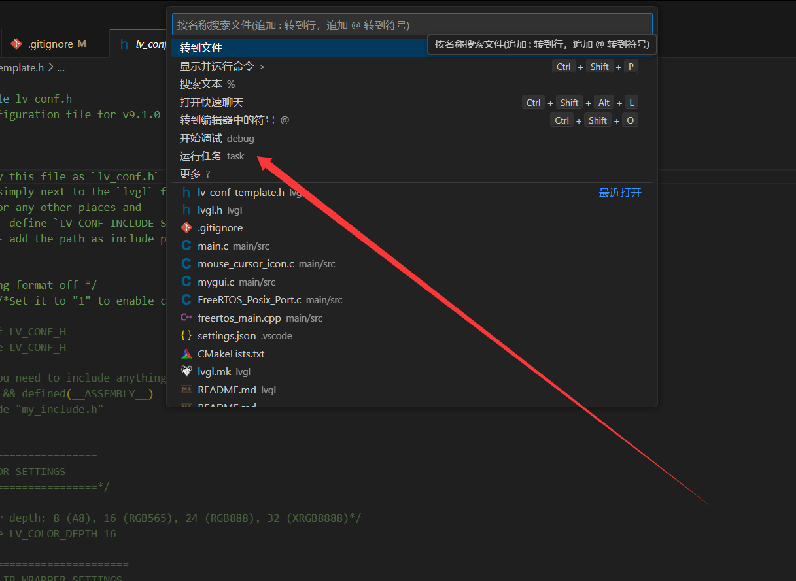
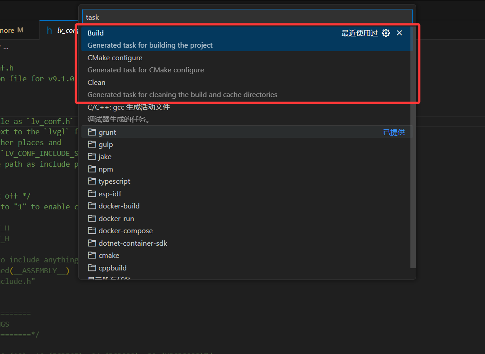
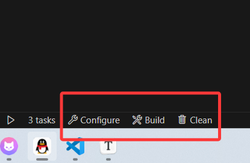
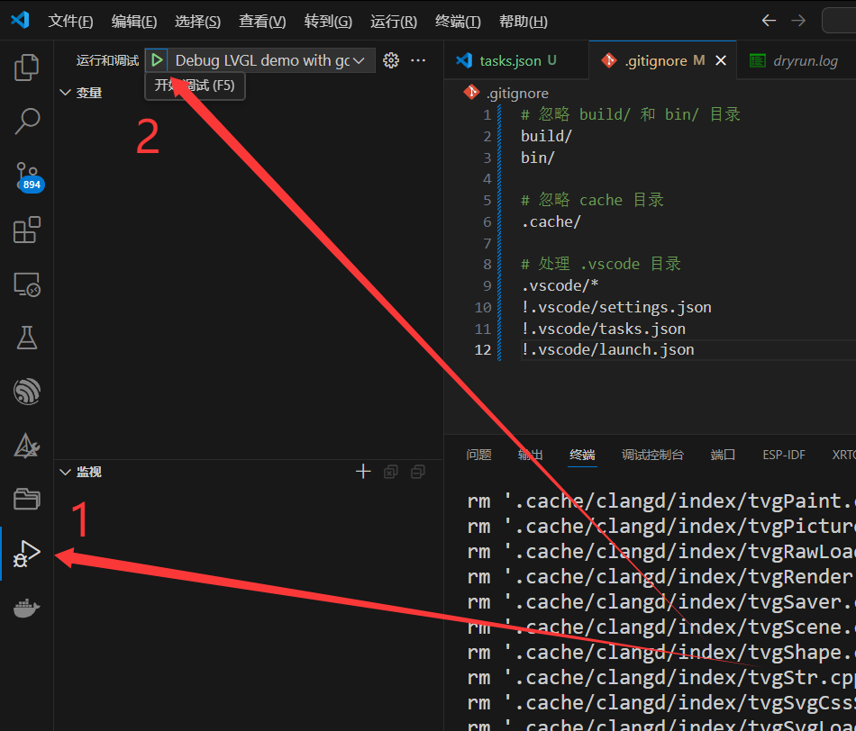
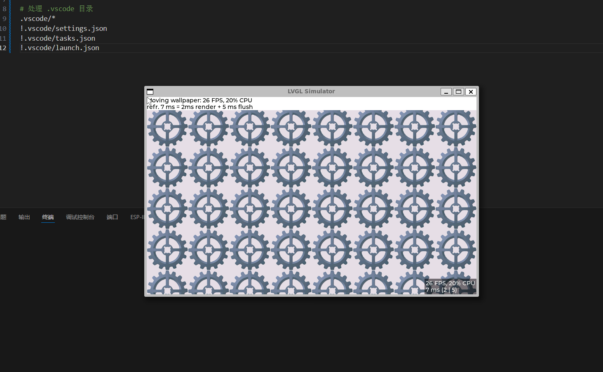
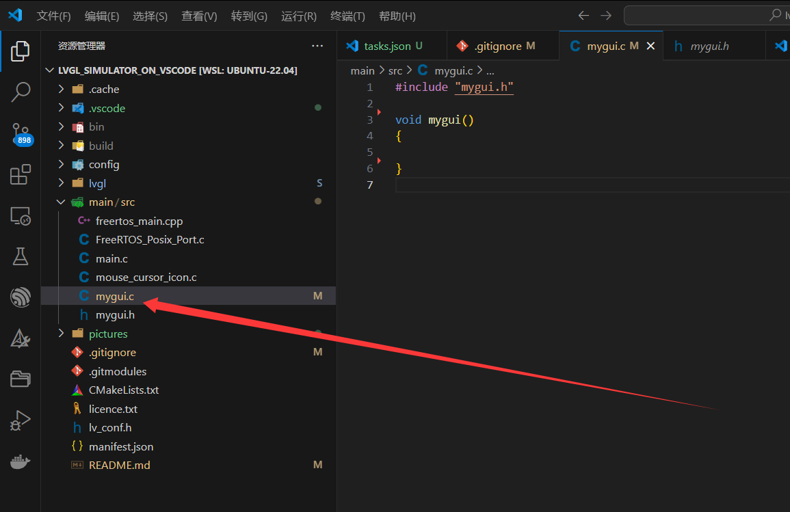
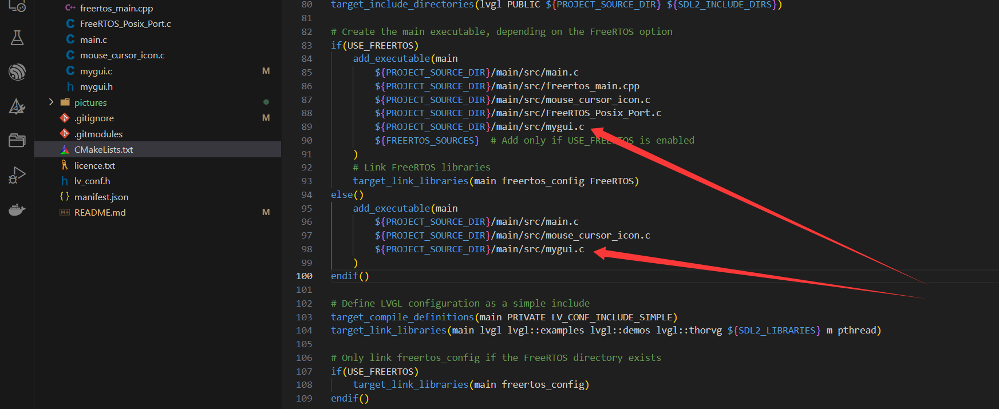

# 基于vscode的LVGL模拟器
---
## 一、简介

在官方仓库的基础上，添加了一些对于我个人更方便的内容。使用的环境为wsl2+ubuntu22.04，其他环境没有尝试过，欢迎添加对不同环境的支持。

不同分支包含不同的LVGL版本，其中：

- **v9分支为v9.1.0版本** （默认分支）
- **v8为v8.3.9版本**
- 其他分支存放了我个人的练习代码

其中，v8和v9模拟器使用的lvgl版本是官方仓库推荐的，对于同一个大版本（比如v9.1和v9.3）应该只替换lvgl文件夹就行（拉取对应版本的lvgl仓库），替换版本出现可能出现的兼容性问题一般无关痛痒，可以自行解决。


#### 获取对应版本的模拟器

```bash
git clone https://github.com/YuanHao2054/lvgl_simulator_on_vscode.git #v9版本

git clone -b v8 https://github.com/YuanHao2054/lvgl_simulator_on_vscode.git #v8版本
```

## 二、使用方法

v8版本的lvgl模拟器默认用makefile进行工程构建，我都修改为了cmake+ninja的方式，并且添加了vscode快捷任务。

### 1、编译流程

通过vscode快捷任务





(详细任务代码见`./.vscode/tasks.json`)

同时，可以通过安装vscode插件**Task Buttons**来使用任务栏地下的快捷按钮



(详细任务代码见`./.vscode/settings.json`)

### 2、调试

在完成调试后，通过vscode的调试功能进行调试



**效果：**




### 3、添加自己的LVGL代码

预留了mygui.c和mygui.h这两个文件作为基础框架



v9版本的模拟器，需要自己添加其他c文件需要在cmakelists文件中添加它（官方的cmake文件不是通过递归查询的方式添加c文件）

v8版本的模拟器，是我根据makefile重写的cmakelists，使用递归查询的方式，不需要手动添加c文件




## 三、以下是我之前存放练习代码的时候写的说明，无需关心


#### 不同分支存放不同部分的学习代码

#### master、1~6是v9版本的模拟器，v8simulator是v8版本的模拟器
- **master**   
    - 默认模板
- **1_base_obj**  
    - 基础部件
- **2_widgets_part1**  
    - 标签
    - 按钮
    - 开个
    - 复选框
- **3_widgets_part2**    
    - 进度条
    - 加载器
    - led部件
    - 列表部件
- **4_widgets_part3**
    - 下拉列表
    - 滚轮
    - 滑块
    - 圆弧
    - 线条
- **5_widgets_part4**
    - 图片
    - 色环
    - 矩阵按钮
    - 文本区域
    - 键盘
- **6_widgets_part5**
    - 图片按钮
    - 选择卡
    - 平铺视图
    - 窗口
- **v8simulator**
    - 图片按钮
    - 选择卡
    - 平铺视图
    - 窗口
    - 消息框
    - 微调器
    - 表格


### 另外还有分支存放练习例程
- **practice1-list**  
列表的练习例程
